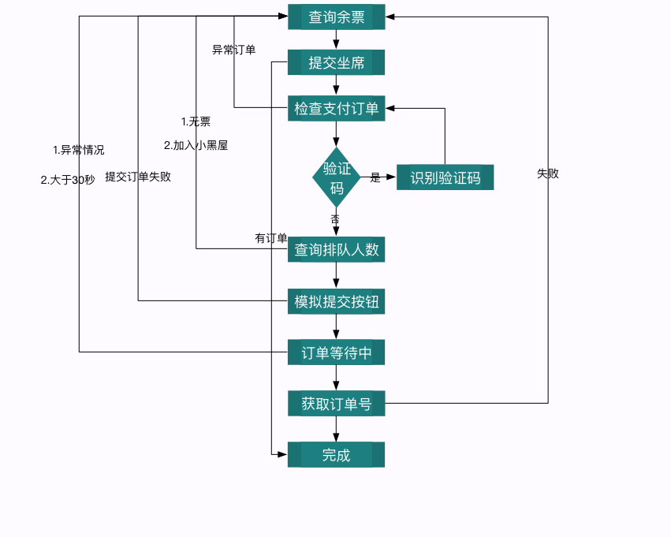

### 12306 购票小助手
#### python版本
  - [ ] 2.7.10 - 2.7.15
  - [x] 3.6 - 3.7.4
  - [ ] 2.7.9

#### 已有功能
  - [x] 自动打码
  - [x] 自动登录
  - [x] 准点预售和捡漏
  - [x] 智能候补
  - [x] 邮件通知
  - [x] server酱通知

#### 依赖库
  - 验证码目前可以本地识别，需要下载模型，放于项目根目录，全部代码来源于此项目 [传送门](https://github.com/zhaipro/easy12306)，表示感谢
    ```
      1. 模型下载链接:https://pan.baidu.com/s/1rS155VjweWVWIJogakechA  密码:bmlm
         群里面也可以下载
      2. git仓库下载：https://github.com/testerSunshine/12306model.git
    ```
  - 自托管云打码服务器搭建：[12306_code_server](https://github.com/YinAoXiong/12306_code_server)
    - 如果大家有空闲的服务器，可搭建之后在这个 [issues](https://github.com/testerSunshine/12306/issues/446) 里面填入自己的服务器(请注意服务器安全！)
  - 项目依赖 [requirements.txt](requirements.txt)
  - 安装方法x:
      - root用户(避免多python环境产生问题): `pip3 install -i https://pypi.tuna.tsinghua.edu.cn/simple -r requirements.txt`
      - 非root用户（避免安装和运行时使用了不同环境）: `pip3 install -i https://pypi.tuna.tsinghua.edu.cn/simple -r requirements.txt`
      - 许多windows的用户装不了tensorflow的话，可以适当降低版本或者升高版本都是可以的
        ```
        1. tensorflow的兼容版本 1.14.0rc\1.14.0rc\1.15.0\1.15.0rc
        以上版本都测试无问题
        2. 如果pip代理的清华源无法下载，可以更换其他源解决此问题
        ```

#### 项目使用说明

  - 服务器启动:
      - 修改[配置](TickerConfig.py)文件
        - 可以配置邮箱,配置邮箱的格式在[配置](TickerConfig.py)里面可以看到ex
            ```
            # 测试邮箱和server酱是否可用， server酱测试的前提是server酱开关开启
            # 可以配置server酱提醒（推荐）[配置教程](https://www.jianshu.com/p/8d10b5b9c4e3)
            # 用python3 还是python 完全取决于安装的时候配置的环境变量是否为python3,以下启动默认环境变量为python3
            python3 run.py t
            ```
        - 配置[配置](TickerConfig.py)文件的时候，需注意空格和遵循python语法格式
      - 启动前请先筛选cdn，这点很`重要`
        ```
        python3 run.py c
        ```
      - 启动服务
        ```
        python3 run.py r
        ```
      - 如果你不知道如何操作，下面的命令可能会帮助你
        ```
        python3 run.py -h

        ——————————————————————————
        sage: run.py [-h] operate

        positional arguments:
          operate     r: 运行抢票程序, c: 过滤cdn, t: 测试邮箱和server酱，server酱
        ```
  - 如果你的服务器安装了docker与docker-compose, 那么你可以忽略上面的**所有**步骤，直接按以下步骤操作，即可开始抢票：
      - 前提条件:
          - 请确认你安装的docker版本为18.09及以上: `docker -v`
          - 请确认你安装的docker-compose版本为1.23.2及以上: `docker-compose -v`
          - 请根据自己需要修改好配置文件:`TickerConfig.py`
          - 请修改配置文件`TickerConfig.py`中的变量`AUTO_CODE_TYPE`和`HOST`，`AUTO_CODE_TYPE`改为`3`, HOST改为`"captcha:80"`（这里很重要，这是本地打码服务器的配置）
      - 运行命令:
          - 开始抢票：`docker-compose up --build -d`
          - 停止抢票：`docker-compose down`
          - 查看抢票log: `docker logs --follow ticket`

#### 目录对应说明
  - agency - cdn代理
  - config - 项目配置
  - verify - 自动打码
  - init - 项目主运行目录
  - inter - 接口
  - myException - 异常
  - myUrllib  request网络请求库

#### 思路图
- 

#### 项目声明：
  - 本软件只供学习交流使用，勿作为商业用途，交流群号
    - 1群：286271084(已满)
    - 2群：649992274(已满)
    - 3群：632501142(已满)
    - 4群: 606340519(已满)
    - 5群: 948526733(已满)
    - 7群: 660689659(已满)
    - 8群: 620629239(已满)
    - 6群: 608792930(未满)
    - 9群: 693035807(未满)
  - 请不要重复加群，一个群就可以了，把机会留给更多人
  - **进群先看公告！！！进群先看公告！！！进群先看公告！！！ 重要的事情说三遍**
  - 能为你抢到一张回家的票，是我最大的心愿

#### 日志列子
   - 成功log，如果是购票失败的，请带上失败的log给我，我尽力帮你调，也可加群一起交流，程序只是加速买票的过程，并不一定能买到票
        ```
        正在第355次查询  乘车日期: 2018-02-12  车次G4741,G2365,G1371,G1377,G1329 查询无票  代理设置 无  总耗时429ms
        车次: G4741 始发车站: 上海 终点站: 邵阳 二等座:有
        正在尝试提交订票...
        尝试提交订单...
        出票成功
        排队成功, 当前余票还剩余: 359 张
        正在使用自动识别验证码功能
        验证码通过,正在提交订单
        提交订单成功！
        排队等待时间预计还剩 -12 ms
        排队等待时间预计还剩 -6 ms
        排队等待时间预计还剩 -7 ms
        排队等待时间预计还剩 -4 ms
        排队等待时间预计还剩 -4 ms
        恭喜您订票成功，订单号为：EB52743573, 请立即打开浏览器登录12306，访问‘未完成订单’，在30分钟内完成支付！
        ```
#### 使用帮助(一些安装问题和使用反馈较多的问题)：
   - 测试邮箱是否可用 [邮箱配置问题看issues](https://github.com/testerSunshine/12306/issues/107)
   - 学生票issues [学生票修改](https://github.com/testerSunshine/12306/issues/47)
   - 依赖安装不对的问题（ImportError）[requirements.txt问题](https://github.com/testerSunshine/12306/issues/91)
   - 若快豆子疑问 [点我](https://github.com/testerSunshine/12306/issues/67)
   - IOError: 【Errno 0】 Error 问题 [点我](https://github.com/testerSunshine/12306/issues/159)
    
   - 测试下单接口是否可用，有两个下单接口，随便用哪个都ok
   - 如果下载验证码过期或者下载失败的问题，应该是12306封ip的策略，多重试几次，12306现在封服务器(阿里云和腾讯云)ip比较严重，尽量不要放在服务器里面
   - 目前12306对服务器ip比较敏感，大家还是在自己家里挂着吧
   - 自动更换ip软件目前已支持TPLINK和小米路由器，只限家庭网络[点我跳转](https://github.com/testerSunshine/AutoRouterIP)


#### 感谢一下小伙伴对本项目提供的帮助
   - @sun7127@126.com
   - @ 才
   - @[MonsterTan](https://github.com/MonsterTan)
   - 以及所有为此项目提供pr的同学
#### 更新日志
   - [更新日志](Update.md)
